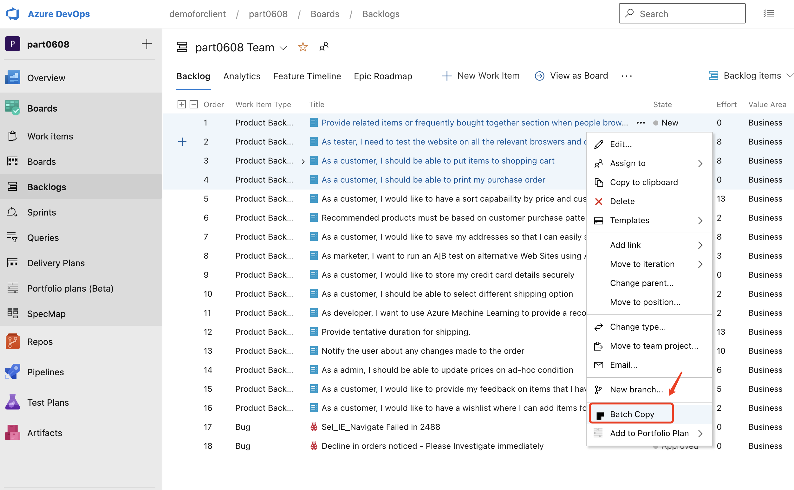
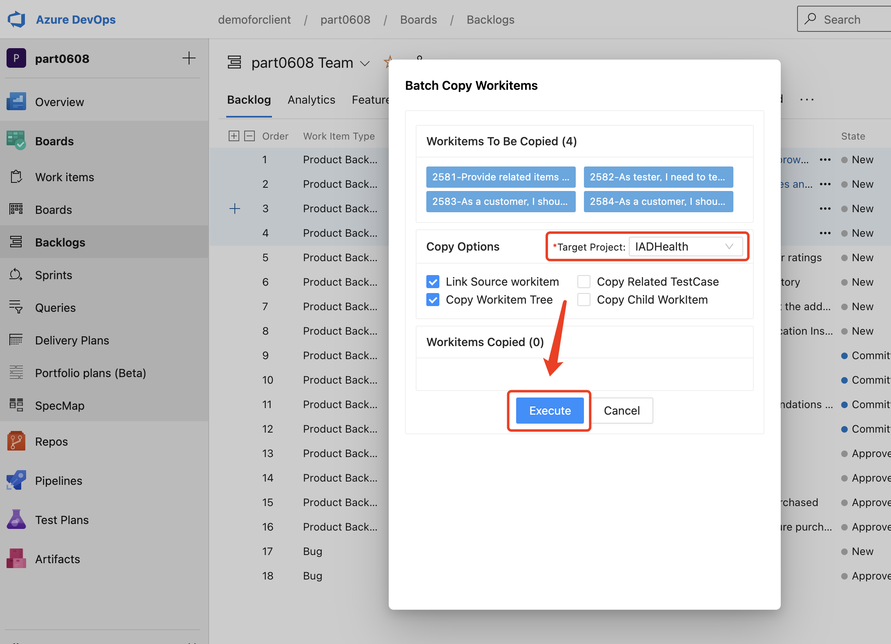
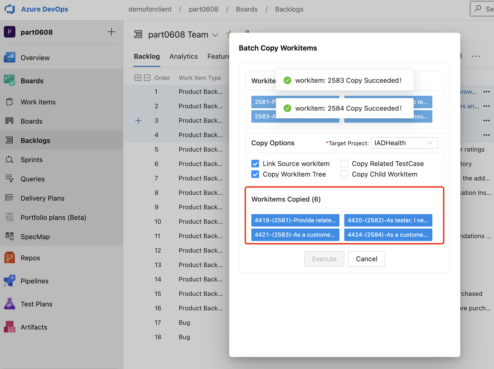
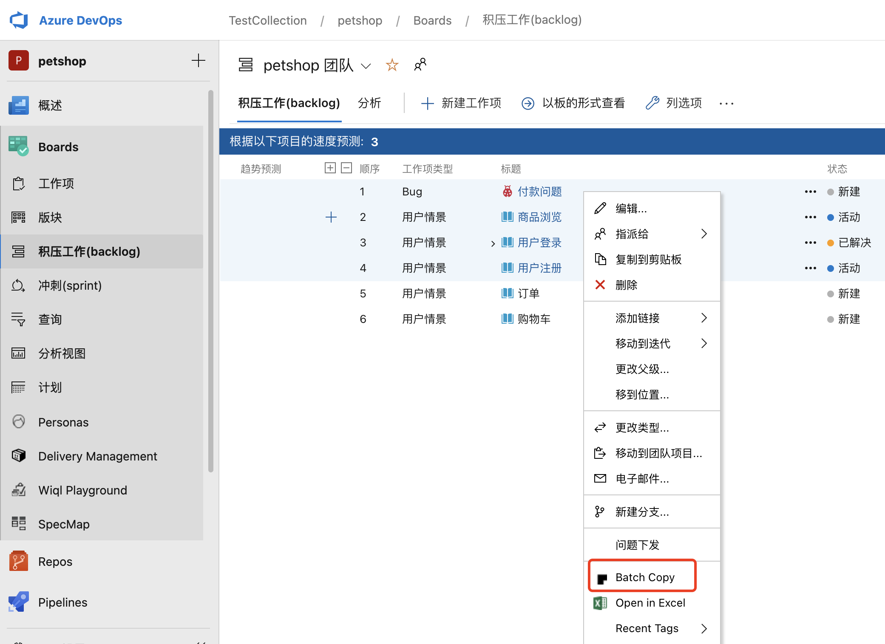
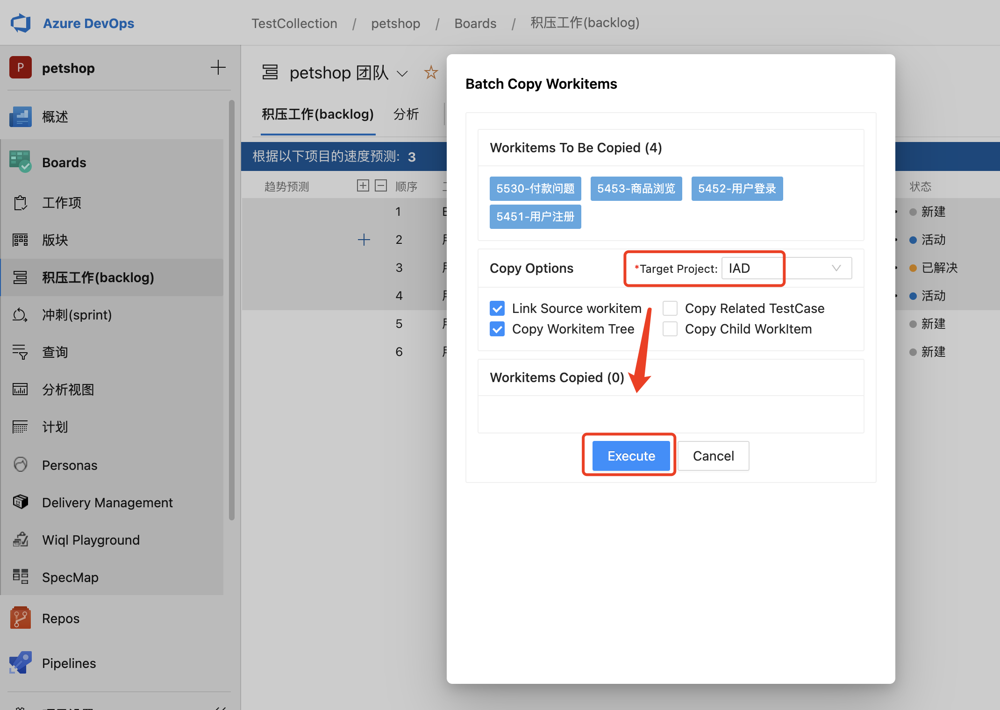
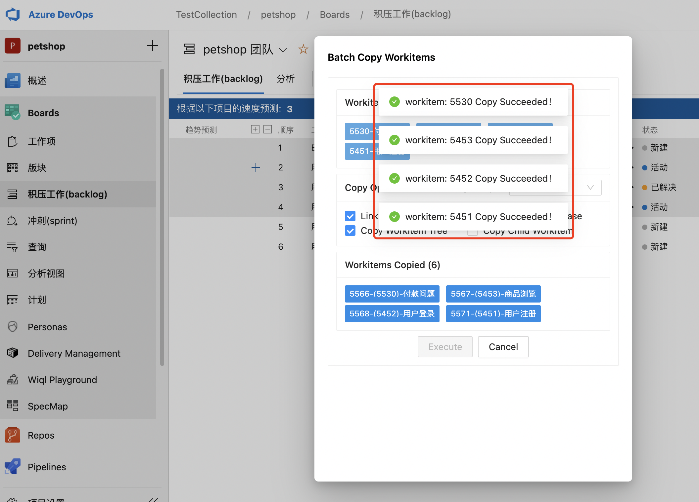

### Workitems Batch Copy for Azure DevOps

Workitems Batch Copy Extension can help you easily copy workitems to another project. It really helps when you want to move workitems to another project or shared workitems (requirements,checklists,testcases) that can be reused in other projects.

### Key Feature

|  Feature | Desc  |
| ------------ | ------------ |
| Workitem Batch Copy  | Copy selected workitems to target project  |
| Link Source Workitem  | Copy selected workitems to target project and setup related link between original and new workitem  |
| Copy Child Workitem | Copy selected workitems with first level of child workitems to target project |
| Copy Workitem Tree | Copy selected workitems and whole workitem tree to target project |
| Copy Related TestCase | Copy selected workitems with testcases to target project |

### User Guide

1. Select the workitems you want to copy and click "Batch Copy" on the right-click context menu.

2. Select the target project and config copy options, then click "Execute" button.

3. Success message will popup after copying.

### Bussiness Support

Please feel free to contact us by email: henryli@leansoftx.com

--------------------------------------------------------------------

### 工作项批量复制插件介绍

工时项批量复制插件，可以方便快速的将项目下选中的工作项批量的复制到其他项目，对于需要将工作项复用到其他项目或移动到其他项目的场景非常有帮助。

### 特性列表

|  特性 | 说明  |
| ------------ | ------------ |
| 批量复制工作项  | 批量复制选中的工作项到目标项目。  |
| 关联原始需求  |  复制后的新需求自动建立于源需求的链接关系，建立追溯关系 |
| 批量复制工作项及子项 |批量复制工作项以及第一层子级工作项|
| 批量复制工作项树 |批量复制工作项以及整个工作项树结构|
| 批量复制工作项以及对应的测试用例 |批量复制工作项以及关联的测试用例|

### 使用说明

1. 选择要复制的工作项，单击右键，点击 “Batch Copy” 菜单，如下图所示：

2. 选择要复制到的目标项目，以及复制相关其他配置项，并点击 “Execute” 如下图所示：

3. 复制成功后会弹出对应的提示，如下图所示：

### 商业支持

如有任何问题可以通过邮件与我们联系：henryli@leansoftx.com

